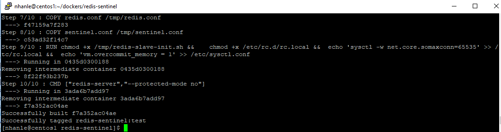
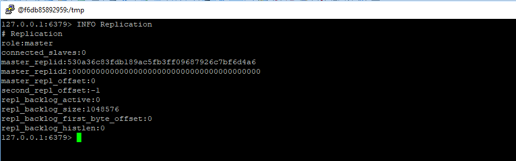
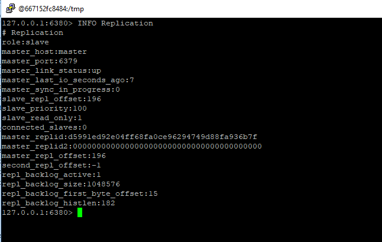
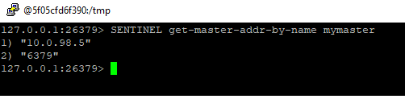
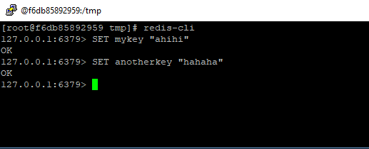
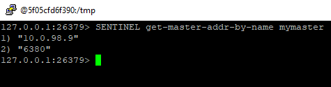
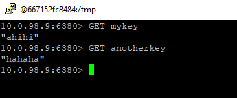

# Setup Redis Replication and Sentinel

### Prerequisite


- A docker swarm with three nodes. To establish quorum, we need at least 3 sentinels (refer to Redis document https://redis.io/topics/sentinel)

For the test purpose, we can run the Sentinels on the same host, however, it is pointless to do so in the Production environment because when there is hardware error when the nodes, we lose all three sentinels

In my case, the Swarm was setup with three nodes: manager node "centos1" and two worker nodes: "centos2", and "centos3".  We will run three sentinels on three different hosts.

- A local registry that can be accessed by all nodes in the Swarm

### Build the docker image

```
	docker build --force-rm -t redis-sentinel:test .
```

wait for some time becuase we build Redis from its source codes.



Now push it the registry

```
docker tag redis-sentinel:test registry.nhan.com:5000/redis-sentinel:test
docker push registry.nhan.com:5000/redis-sentinel:test
```

Let explain the purpose of files.
- "redis-slave-init.sh" This bash script file is to create the "redis-slave.conf" if it does not exist. The two import paramters are:
	+ slaveof: will get the master host and port from environment variables (we dont want to hard code them)
	+ slave-announce-ip: because docker swarm us overlay network, the internal container IP is diffent from the IP that other container see. If we dont do this, the master/sentinel instance will record a wrong IP and automatic failer-over will failer-over

### Run the containers

The folder has three files:
- docker-compose-master.yml. Use this to start the Redis master instance in "centos2" node
- docker-compose-slave.yml. Use this to start two slave instances which replicate data from the master node
- docker-compose-sentinel.yml. Use the to start 3 sentinels on three nodes. I use "global" deploy mode to ensure only 1 instance per node.

Now let start the master node first

```
	docker stack deploy --compose-file=docker-compose-master.yml redis
```

To connect to a running container, use the command "docker exec -it <container_id> /bin/bash"

Connect to the "master" container on centos2 host, then user "redis-cli" to check its status



Now start the slaves

```
docker stack deploy --compose-file=docker-compose-slave.yml redis
```
There will be two slave instance running on centos1 and centos3 host
Let check one of the slave

Connect to the slave container and run "redis-cli -p 6380"



Now start the sentinels

```
docker stack deploy --compose-file=docker-compose-sentinel.yml redis
```

Let check one of sentinels , connect to the container, then use "redis-cli -p 26379"

Run these commands in "redis-cli" and observe the result
```
	sentinel master mymaster
	sentinel slaves mymaster
	sentinel sentinels mymaster
```

All client connection which supports Sentinel must connect to the Sentinels and ask which is the current master by command below

```
	SENTINEL get-master-addr-by-name mymaster
```


As we can see in the image, the master is still the master now. Its port is 6379

### Do some test

Connect to the master instance and add some keys




### Simulate master failure

So far so good!
To simulate the master instance fail, use "redis-cli DEBUG sleep 30000"

Let it run, do not press "CTRL+C"

Now let connect to the sentinel and ask who is the master

```
	SENTINEL get-master-addr-by-name mymaster
```



You can see that there master IP has change to one of the slaves. Its port is now 6380

Let connect to the new master, and query the keys we added above
```
	redis-cli -p 6380 -h 10.0.98.9
```



whoa, the keys are still there, there is no data loss!


